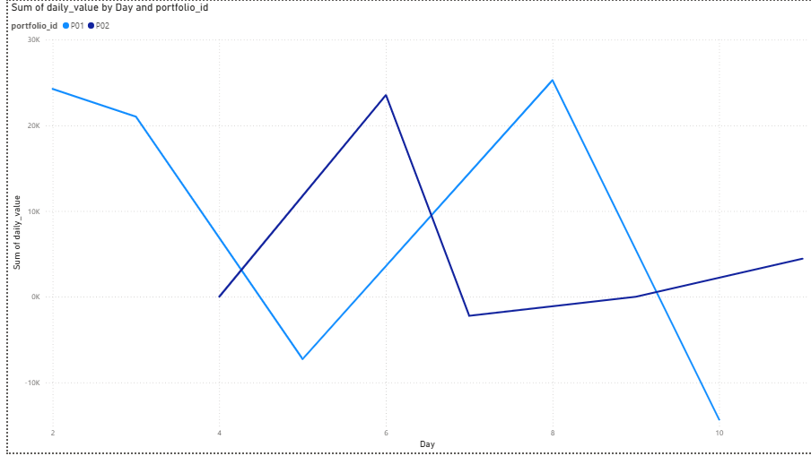

# Cloud Financial Data Pipeline

## Overview

This project is an **end-to-end cloud-based data pipeline** that extracts, transforms, and visualizes portfolio-level financial data. It demonstrates how raw market data and internal transaction data can be processed and analyzed using Python, Google Cloud Platform, BigQuery, and Power BI.  

The goal is to **explore how an end-to-end workflow could work**, from raw data to simple graph. Working through this project helped me understand the practical role of cloud services like Google Cloud Storage and BigQuery, from storing raw and processed data to querying analytics-ready datasets efficiently. On the visualization side, building dashboards in Power BI highlighted how transformed data can be made actionable and accessible

---

## Workflow

The pipeline follows the **ETL (Extract → Transform → Load) pattern**:

```
Yahoo Finance API / Internal CSVs
           ↓
     Raw Data in Google Cloud Storage (GCS)
           ↓
   Transform Script (Python)
           ↓
  Processed CSVs in GCS
           ↓
     Load into BigQuery
           ↓
   Power BI Dashboard / Analytics
```

1. **Extract**  
   - Market data is pulled from Yahoo Finance API.  
   - Internal transaction CSVs are stored locally or uploaded to GCS.  

2. **Transform**  
   - Python scripts merge market and mock transaction data.  
   - Daily portfolio values and returns are calculated.  
   - Missing market data is handled, and performance-aware calculations are applied.  

3. **Load**  
   - Processed CSVs are uploaded to **Google Cloud Storage**.  
   - From GCS, data is loaded into **BigQuery** tables (`portfolio_analytics` dataset).  

4. **Visualize**  
   - Power BI dashboards connect directly to BigQuery.  
   - Interactive line charts show **daily portfolio values** for multiple portfolios.  
   - Tables display **daily returns**, and slicers allow filtering by **portfolio** and **date range**.  

---

## Example Dashboard

  

*Line chart showing daily portfolio values for P01 and P02. Data is processed in Python, stored in BigQuery, and visualized in Power BI.*

---

## Key Features

- **Cloud-based ETL**: Data is extracted, transformed, and loaded using Python scripts and Google Cloud services.  
- **BigQuery Integration**: Processed datasets are stored in BigQuery for scalable analytics.  
- **Interactive Power BI Dashboard**: Visualize portfolio daily values and returns, with filters and drill-downs by date and portfolio.  
- **End-to-End Automation Ready**: Scripts can be scheduled to run automatically, updating dashboards with the latest data.  

---

## Technologies

- **Python**: Pandas for data manipulation, Python scripts for ETL  
- **Google Cloud Storage**: Raw and processed CSV storage  
- **BigQuery**: Cloud data warehouse for processed portfolio data  
- **Power BI**: Dashboard and analytics visualization  
- **dotenv**: Environment variable management for credentials and project configuration  

---

## Getting Started

1. **Clone the repository**  
   ```bash
   git clone https://github.com/jtran217/cloud-financial-data-pipeline.git
   cd cloud-financial-data-pipeline
   ```

2. **Install dependencies**  
   ```bash
   pip install -r requirements.txt
   ```

3. **Set environment variables in `.env`**  
   ```
   GCS_BUCKET_NAME=your-gcs-bucket
   GCP_PROJECT_ID=your-gcp-project
   BIGQUERY_DATASET=portfolio_analytics
   GOOGLE_APPLICATION_CREDENTIALS=path/to/your/key.json
   ```

4. **Run the ETL pipeline**  
   ```bash
   python etl/extract_market_data.py
   python etl/transform_portfolio_data.py
   python etl/load_to_bigquery.py
   ```

5. **Connect Power BI to BigQuery**  
   - Load `portfolio_analytics` tables  
   - Build line charts, tables, and slicers to visualize portfolio performance  

---

## Notes
- The pipeline can be **expanded to more portfolios or tickers** by updating the CSV sources and running the ETL scripts.  
- The Power BI dashboard can be **scheduled for automatic refresh** when connected to BigQuery.


